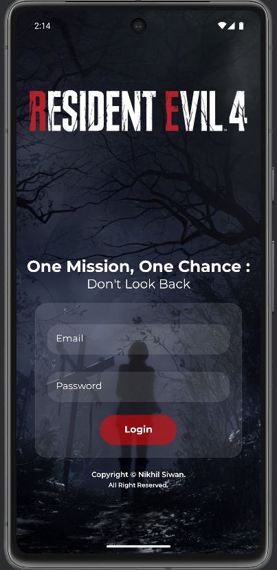

# 🧟 Resident Evil 4 Remake Companion App

[](LICENSE)
[](https://reactnative.dev/)
[]()

> 💥 Dive into every moment, mystery, and storyline of the **Resident Evil 4 Remake**. Built for fans who crave a deeper experience.

---

## 👾 Overview

The **Resident Evil 4 Remake Companion App** is a fan-made mobile and web application that brings the world of *RE4 Remake* right to your fingertips. From in-depth story breakdowns to hidden puzzles and lore – this app is your ultimate survival guide.

Whether you're re-experiencing the horror or discovering it for the first time, this app enhances your gameplay and exploration of the iconic survival horror masterpiece.

---

## 🚀 Features

🔪 **Storyline Breakdown**
- Full chapter-wise summaries with key cutscenes
- Chronological storyline that includes every emotional beat

🧩 **Mysteries & Secrets**
- Hidden paths, obscure puzzles, strange writings, and game lore
- Full solutions and story context

🧠 **Character Encyclopedia**
- Deep dives into Leon, Ashley, Ada, Luis, Krauser, Saddler & more
- Backstories, quotes, relationships

🎮 **Gameplay Moments**
- Major boss fights, combat tips, and iconic sequences
- Strategies and environment breakdowns

🗺️ **Interactive Map (Coming Soon)**
- Locate blue medallions, merchants, weapons, and key zones
- Toggle by chapter, enemy, item, and area

🎭 **Easter Eggs & Fan Theories**
- Hidden in-game references and fan-favorite mysteries
- A tribute to decades of Resident Evil fandom

---

## 📸 Screenshots

> *Preview Coming Soon* – UI, Maps, Character Cards, and Chapter Pages will be showcased here.



---

## 🛠️ Tech Stack

- **Frontend:** React Native (Expo) or React.js (Web)
- **Backend:** Firebase 
- **Database:** Firestore 
- **Design:** Figma / Adobe XD
- **Deployment:** Vercel / Netlify / Play Store *(TBD)*

---

## 📦 Installation

```bash
# Clone the repo
git clone https://github.com/your-username/re4-remake-companion.git

# Navigate to project directory
cd re4-remake-companion

# Install dependencies
npm install

# Run the app
npm start
